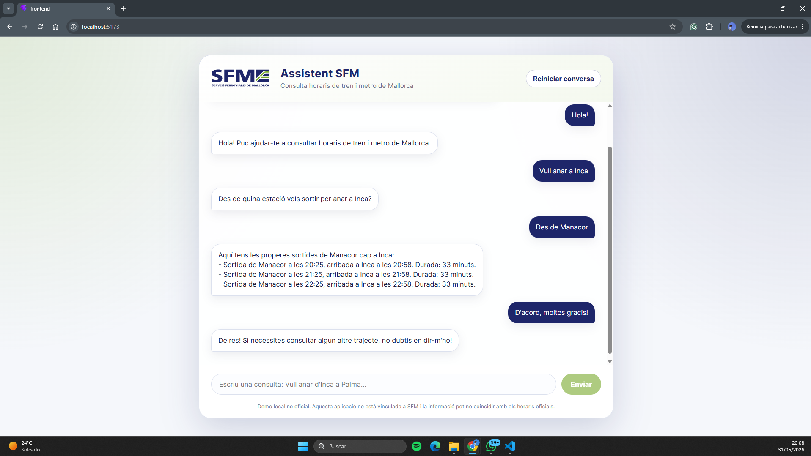

# Frontend — SFM Assistant

React frontend for SFM Assistant, a conversational demo application for checking train and metro schedules in Mallorca.

The frontend provides a clean chat interface where users can ask schedule questions in Catalan. It communicates with the FastAPI backend through the `POST /chat` endpoint and displays the assistant response in a simple, user-friendly layout.

> This frontend is part of an educational demo. It is not affiliated with Serveis Ferroviaris de Mallorca (SFM), and the information shown may not match official real-time schedules.

---

## Live Demo

You can try the deployed demo here:

```text
https://sfm-assistant.vercel.app/
```

> Note: the backend runs on a free Render instance. If the app has been inactive for a while, the first request may take some time while the backend wakes up.

---

## Demo Preview

<p align="center">
  
</p>

---

## Table of Contents

* [Overview](#overview)
* [Main Features](#main-features)
* [Tech Stack](#tech-stack)
* [Frontend Structure](#frontend-structure)
* [How It Works](#how-it-works)
* [Main Files](#main-files)
* [Connection with the Backend](#connection-with-the-backend)
* [Environment Variables](#environment-variables)
* [Conversation State](#conversation-state)
* [User Interface](#user-interface)
* [Styling](#styling)
* [Responsive Design](#responsive-design)
* [Installation](#installation)
* [Running the Frontend Locally](#running-the-frontend-locally)
* [Available Scripts](#available-scripts)
* [Testing the Interface](#testing-the-interface)
* [Build for Production](#build-for-production)
* [Deployment](#deployment)
* [Common Issues](#common-issues)
* [Known Limitations](#known-limitations)
* [Future Improvements](#future-improvements)
* [Relationship with the Backend](#relationship-with-the-backend)
* [Disclaimer](#disclaimer)

---

## Overview

The frontend is the user-facing part of SFM Assistant.

It allows users to interact with the chatbot through a chat-style interface. The user writes a message, the frontend sends it to the backend, and the backend returns a final response in Catalan.

Example user messages:

```text
Vull anar de Manacor a Palma
```

```text
Quins trens hi ha d'Inca a Palma dematí?
```

```text
Vull arribar a Palma abans de les 9 des d'Inca
```

```text
Vull anar a Vilafranca
```

```text
I demà dematí?
```

The frontend does not interpret transport data by itself. It only manages the interface, sends requests, stores the `conversation_id` and displays the backend response.

---

## Main Features

* Clean chat interface.
* User and assistant message bubbles.
* Catalan-first user experience.
* Connection with the FastAPI backend.
* Public deployment on Vercel.
* Persistent `conversation_id` using `localStorage`.
* Conversation reset button.
* Loading animation while the backend responds.
* Basic frontend error handling.
* SFM-inspired visual identity.
* Non-official local demo notice.
* Responsive layout for smaller screens.
* Technical metadata hidden from the user-facing interface.

---

## Tech Stack

* React
* Vite
* JavaScript
* CSS
* Fetch API
* LocalStorage
* Vercel

---

## Frontend Structure

```text
frontend/

├── public/
│   └── SFM_Color.svg
│
├── src/
│   ├── App.jsx
│   ├── App.css
│   └── main.jsx
│
├── .env.example
├── package.json
├── vite.config.js
└── README.md
```

---

## How It Works

The frontend follows a simple request-response flow.

```text
User writes a message
↓
Frontend adds the user message to the chat
↓
Frontend sends message + conversation_id to POST /chat
↓
Backend processes the query
↓
Backend returns a response
↓
Frontend stores the conversation_id
↓
Frontend displays the assistant response
```

The backend is responsible for:

* understanding the message
* validating stations
* maintaining conversational context
* searching schedules
* generating the final response
* preventing unsafe or hallucinated responses

The frontend is responsible for:

* displaying the interface
* handling user input
* calling the API
* showing loading and error states
* storing the `conversation_id`

---

## Main Files

## `src/App.jsx`

Main React component.

Responsibilities:

* Store chat messages in component state.
* Store the current input value.
* Send requests to the backend.
* Receive and display backend responses.
* Store and reuse `conversation_id`.
* Reset the conversation.
* Display loading state.
* Display connection errors.
* Read the backend URL from `VITE_API_URL` when available.

---

## `src/App.css`

Main stylesheet.

Defines:

* app layout
* chat card
* header
* SFM logo sizing
* message bubbles
* input form
* send button
* loading animation
* non-official demo notice
* responsive behavior

---

## `src/main.jsx`

React entry point.

It renders the main `App` component into the DOM.

---

## `public/SFM_Color.svg`

SFM logo used in the application header.

The project uses the logo for visual context in an educational demo. The application clearly states that it is not an official SFM product.

---

## Connection with the Backend

The frontend sends messages to the backend endpoint configured through the environment variable:

```env
VITE_API_URL
```

In production, this points to the deployed Render backend:

```text
https://sfm-assistant-o2st.onrender.com/chat
```

In local development, the frontend can use the local backend:

```text
http://127.0.0.1:8000/chat
```

A typical request looks like this:

```json
{
  "message": "Vull anar d'Inca a Palma",
  "conversation_id": null
}
```

If a conversation already exists, the frontend sends the stored `conversation_id`:

```json
{
  "message": "A Palma",
  "conversation_id": "existing-conversation-id"
}
```

A typical backend response looks like this:

```json
{
  "conversation_id": "uuid",
  "response": "Aquí tens les properes sortides d'Inca cap a Palma Estació Intermodal...",
  "intent_source": "gemini",
  "response_source": "gemini",
  "debug": {
    "intent": "train_query",
    "results_count": 3
  }
}
```

The frontend displays only the user-facing `response`.

Technical metadata such as `intent_source`, `response_source` and `debug` may still be returned by the backend, but it is not shown in the clean user interface.

---

## Environment Variables

The frontend uses Vite environment variables.

Create a local environment file if needed:

```text
frontend/.env.local
```

Example:

```env
VITE_API_URL=http://127.0.0.1:8000/chat
```

For production on Vercel:

```env
VITE_API_URL=https://sfm-assistant-o2st.onrender.com/chat
```

The project also includes:

```text
frontend/.env.example
```

This file documents the expected variables and can be safely committed to GitHub.

Do not commit `.env.local` or any file containing secrets.

---

## Conversation State

The frontend stores the backend `conversation_id` in `localStorage`.

Storage key:

```text
sfm_conversation_id
```

This allows the backend to maintain context across multiple user messages.

Example:

```text
User: Vull anar a Palma
Bot: Des de quina estació vols sortir per anar a Palma Estació Intermodal?
User: Des de Manacor
Bot: Shows Manacor → Palma options.
```

The frontend sends the same `conversation_id` with each request, allowing the backend to complete the pending query.

---

## Resetting the Conversation

The `Reiniciar conversa` button:

* removes the stored `conversation_id`
* clears the visible chat messages
* restores the initial assistant greeting
* starts a new conversation on the next request

This is useful when the user wants to start a completely new query flow.

---

## User Interface

The interface is designed as a centered chat card.

It includes:

* header with SFM logo and application title
* subtitle explaining the purpose of the assistant
* reset conversation button
* scrollable message area
* input field
* send button
* loading indicator
* non-official demo notice

The current UI intentionally avoids showing internal debug labels or development metadata to the user.

---

## Initial Message

When the app loads, it displays an initial assistant message:

```text
Hola! Som l’assistent de SFM. Puc ajudar-te a consultar horaris de tren i metro de Mallorca.
```

This message is defined in the frontend and is shown before the user sends the first request.

---

## Loading State

When a message is being sent:

* the input is disabled
* the send button is disabled
* a small animated loading indicator is displayed
* the user cannot send empty messages

If the backend returns successfully, the assistant response is added to the chat.

If the request fails, the frontend shows a user-friendly error message.

---

## Error Handling

If the frontend cannot connect to the backend, it displays:

```text
Ara mateix no puc connectar amb el servidor. Comprova que el backend està en marxa.
```

Common causes:

* backend is not running
* backend is running on a different port
* Render free instance is waking up
* CORS configuration issue
* `/chat` endpoint returned an error
* network error
* invalid backend URL

---

## Styling

The visual identity is inspired by SFM colors.

Main CSS variables:

```css
--sfm-blue: #002e6d;
--sfm-green: #61a60e;
--sfm-blue-soft: #e9f0fa;
--sfm-green-soft: #eef7e7;
--text-main: #14213d;
--text-muted: #65758b;
--border: #d9e2ef;
--surface: #ffffff;
--background: #f4f7fb;
```

The design uses:

* rounded chat container
* soft shadows
* white message bubbles for the assistant
* dark blue message bubbles for the user
* green send button
* subtle radial background
* compact loading dots
* centered non-official demo notice

---

## Responsive Design

The CSS includes responsive behavior for smaller screens.

On mobile:

* the chat card takes the full viewport height
* border radius is removed
* header layout becomes vertical
* logo is reduced
* horizontal padding is reduced
* the form can stack vertically
* message bubbles use more available width

This keeps the interface usable on both desktop and mobile screens.

---

## Installation

From the project root:

```bash
cd frontend
```

Install dependencies:

```bash
npm install
```

---

## Running the Frontend Locally

Start the development server:

```bash
npm run dev
```

The app will usually be available at:

```text
http://localhost:5173
```

or:

```text
http://127.0.0.1:5173
```

The backend must also be running.

From the `backend/` folder:

```bash
uvicorn app.main:app --reload
```

Backend URL:

```text
http://127.0.0.1:8000
```

Health check:

```text
http://127.0.0.1:8000/health
```

---

## Available Scripts

## `npm install`

Installs project dependencies.

```bash
npm install
```

---

## `npm run dev`

Starts the Vite development server.

```bash
npm run dev
```

---

## `npm run build`

Builds the frontend for production.

```bash
npm run build
```

The output is generated in:

```text
dist/
```

---

## `npm run preview`

Previews the production build locally.

```bash
npm run preview
```

---

## Testing the Interface

With both backend and frontend running, open:

```text
http://localhost:5173
```

Recommended manual tests:

### Greeting

```text
Hola
```

Expected behavior:

The assistant returns a greeting in Catalan.

---

### Direct route query

```text
Vull anar d'Inca a Palma
```

Expected behavior:

The assistant returns the next available train options.

---

### Time-window query

```text
Quins trens hi ha d'Inca a Palma dematí?
```

Expected behavior:

The assistant returns options within the morning time window.

---

### Arrival-before query

```text
Vull arribar a Palma abans de les 9 des d'Inca
```

Expected behavior:

The assistant returns trains arriving before 09:00.

---

### Incomplete query

```text
Vull anar a Palma
```

Expected behavior:

The assistant asks for the origin station.

Then send:

```text
Des de Manacor
```

Expected behavior:

The assistant completes the pending query and shows Manacor → Palma options.

---

### Known place without train service

```text
Vull anar a Vilafranca
```

Expected behavior:

The assistant explains that Vilafranca de Bonany does not currently appear as a train or metro stop in the loaded demo data.

---

### Contextual follow-up

First:

```text
Vull anar de Manacor a Inca
```

Then:

```text
I demà dematí?
```

Expected behavior:

The backend reuses the previous route and changes only the date and time window.

---

### Relative follow-up

First:

```text
Vull anar d'Inca a Palma
```

Then:

```text
I un més tard?
```

Expected behavior:

The backend reuses the previous route and returns a later option.

---

### Out-of-domain query

```text
Quin temps farà demà?
```

Expected behavior:

The assistant explains that it can only help with train and metro schedule queries.

---

## Build for Production

Generate a production build:

```bash
npm run build
```

This creates:

```text
dist/
```

The generated files can be deployed to static hosting platforms such as:

* Vercel
* Netlify
* GitHub Pages
* Cloudflare Pages
* a custom static server

The deployed frontend must point to the correct backend URL through `VITE_API_URL`.

---

## Deployment

The frontend is deployed on Vercel:

```text
https://sfm-assistant.vercel.app/
```

Production configuration:

```env
VITE_API_URL=https://sfm-assistant-o2st.onrender.com/chat
```

Deployment settings on Vercel:

```text
Framework Preset: Vite
Root Directory: frontend
Build Command: npm run build
Output Directory: dist
Install Command: npm install
```

After changing environment variables in Vercel, the project must be redeployed because Vite injects `VITE_` variables at build time.

---

## Common Issues

## Frontend does not start

Make sure dependencies are installed:

```bash
npm install
```

Then run:

```bash
npm run dev
```

---

## Frontend cannot connect to backend

Check that the backend is running locally:

```text
http://127.0.0.1:8000/health
```

For the deployed version, check the Render backend health endpoint:

```text
https://sfm-assistant-o2st.onrender.com/health
```

Also check that `VITE_API_URL` points to the correct `/chat` endpoint.

---

## First request is slow in production

The backend runs on a free Render instance.

If the service has been inactive for a while, the first request may take longer because the backend needs to wake up.

This is expected behavior for the free hosting tier.

---

## CORS error

The backend must allow the frontend origin.

During local development, typical frontend origins are:

```text
http://localhost:5173
http://127.0.0.1:5173
```

In production, the backend must allow:

```text
https://sfm-assistant.vercel.app
```

The production frontend URL should be configured in the backend environment variable:

```env
FRONTEND_URL=https://sfm-assistant.vercel.app
```

If the frontend runs on a different domain, the backend CORS configuration must be updated.

---

## Conversation context is not preserved

Check that the browser is not blocking `localStorage`.

The frontend stores the conversation ID under:

```text
sfm_conversation_id
```

Press `Reiniciar conversa` to clear the current conversation and start a new one.

---

## Backend returns a fallback response

Fallback responses are not a frontend issue.

They usually mean that:

* Gemini was unavailable
* Gemini quota was exceeded
* Gemini returned invalid JSON
* the hallucination guard rejected the generated response
* the backend intentionally used a safe template

Check the backend logs or debug endpoints for more details.

---

## Known Limitations

Current frontend limitations:

* No login.
* No persistent chat history.
* Only the `conversation_id` is stored locally.
* Reloading the page keeps the backend context ID but does not restore old visible messages.
* No frontend test suite yet.
* No advanced result cards or timetable view yet.
* No offline mode.
* The deployed backend may have cold starts because it runs on a free hosting tier.

---

## Future Improvements

Potential improvements:

* Store visible chat history in `localStorage`.
* Add a clear “new chat” confirmation.
* Add result cards for train options.
* Add icons for train and metro.
* Add better accessibility labels.
* Add keyboard shortcuts.
* Add automated tests with Vitest and React Testing Library.
* Add deployment-specific documentation for custom domains.
* Add dark mode.
* Add a compact mobile-first layout variant.
* Add optional debug mode controlled by an environment variable.
* Add a visual warning when the backend is waking up.

---

## Relationship with the Backend

This frontend depends on the SFM Assistant backend.

Backend documentation:

```text
../backend/README.md
```

The backend handles:

* natural language interpretation
* conversation memory
* station validation
* schedule search
* Gemini integration
* response generation
* hallucination protection

The frontend handles:

* user interaction
* visual chat layout
* API calls
* loading state
* local `conversation_id` storage

---

## Disclaimer

This frontend is part of an independent educational demo. It is not affiliated with, endorsed by or officially connected to Serveis Ferroviaris de Mallorca.

The interface may display locally loaded demo schedule data that does not match the current official service. For official and up-to-date transport information, users should always consult the official transport provider.
